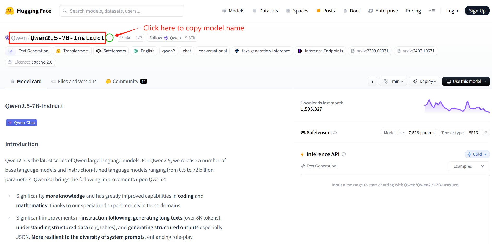
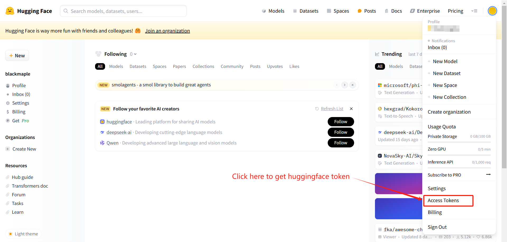
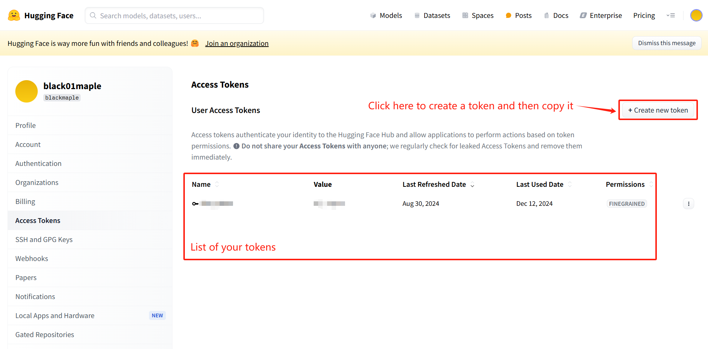

# HF_Download_Docker
Build a docker image to download models from huggingface. Using hf mirror.

# Quick Start

## 1. Building docker image
```bash
docker build -t hf_download:latest .
```

## 2. Start the container
The command to start the container is as follows:
```bash
docker run --rm -v /your_download_path:/opt/saved_model_parameters -e model_name=download_model_name -e token=your_huggingface_token hf_download:latest
```
You may need to fill in the variables **your_download_path**, **download_model_name** and **your_huggingface_token**. 
Example:
```bash
docker run --rm -v /data/my_models:/opt/saved_model_parameters -e model_name=Qwen/Qwen2.5-14B-Instruct -e token=hf_xxxxxx hf_download:latest
```
Just start the container to begin the download, and the container will be automatically deleted after the download is completed.

### Supplementary Note 1 model_name acquisition method

  Go to the Hugging Face official website, find the model you need to download, and click the copy button on the right side of the model name (as shown in the figure below).
  

### Supplementary Note 2 huggingface token acquisition method

  Go to the Hugging Face official website, log in to your account in the upper right corner (you can register an account if you don't have one). After logging in, click on your avatar and select Access Token.
  
  On the following page, create your Hugging Face token and remember to copy and save it in a suitable place. Your token will only be displayed once after creation. If you need to use it repeatedly, please remember to save it.
  
