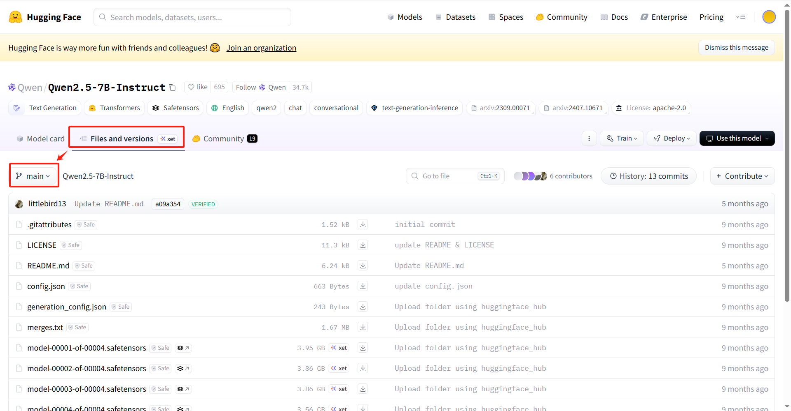

Build a Docker image for downloading models from Hugging Face, using the `hf mirror` image source (available in mainland China).

# Quick Start

## 1. Build the Image

```bash
docker build -t hf_download:latest .
```

## 2. Run the Container

The command to run the container is as follows:

```bash
docker run --rm -it \
  -v <your download directory>:/opt/saved_model_parameters \
  -e repo_id=<repository name> \
  -e repo_type=<repository type> \
  -e branch=<repository branch> \
  -e token=<your Hugging Face account token> \
  hf_download:latest
```

Parameter Description:

| Parameter Name | Parameter Description                                        | Required                                                   | Example Value           |
| -------------- | ------------------------------------------------------------ | ---------------------------------------------------------- | ----------------------- |
| repo_id        | Repository name (repository ID)                              | Yes                                                        | Qwen/Qwen3-Embedding-8B |
| repo_type      | Repository type, available options are:<br />model: Model repository<br />dataset: Dataset repository<br />space: Space repository | No<br />Default value is model.                            | model                   |
| branch         | Repository branch                                            | No<br />Default value is None, indicating the main branch. |                         |
| token          | Hugging Face account token, required only when downloading private repositories<br />For example, meta-llama/Llama-3.1-8B-Instruct requires logging into Hugging Face and applying for access rights before downloading. The account token must be provided during download. | No<br />Default value is None.                             | hf_xxxxxxxxx            |

Example command:

```bash
docker run --rm -it -v /data/my_models:/opt/saved_model_parameters -e repo_id=Qwen/Qwen2.5-14B-Instruct hf_download:latest
```

Once the container is started, the download will begin. The container will be automatically removed after the download is complete.

### Additional Notes

#### 1. How to Obtain the Repository Name (`repo_id`)

Go to the Hugging Face official website, find the model you want to download, and click the copy button to the right of the model name (as shown in the figure below).


#### 2. How to Obtain the Repository Branch (`branch`)

Go to the Hugging Face official website, find the model you want to download, and click "Files and versions" to view the repository files. The branch name is indicated at the top-left corner of the file list. This parameter is reserved for special cases, as most repositories only have a main branch.




#### 3. How to Obtain the Hugging Face Account Token

Go to the Hugging Face official website, log in to your account in the top-right corner (you can register if you don't have an account). After logging in, click on your avatar and select Access Token.


On the following page, create your Hugging Face token and remember to copy and save it to a suitable place. Your token will only be displayed once after creation. If you need to use it repeatedly, make sure to save it.


