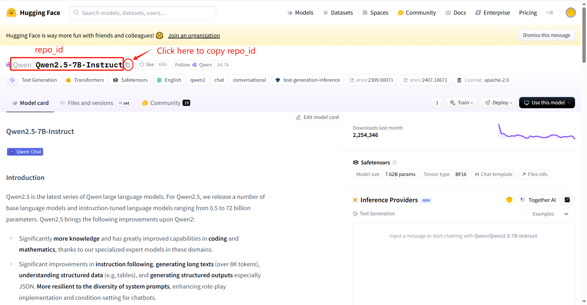

构建一个用来下载huggingface上模型的docker镜像。使用hf mirror镜像源（国内可用）。

# Quick Start

## 1. 构建镜像
```bash
docker build -t hf_download:latest .
```

## 2. 启动容器
启动容器的指令如下
```bash
docker run --rm -v /你的下载目录:/opt/saved_model_parameters -e model_name=模型名称 -e token=你的huggingface账号token hf_download:latest
```
需要填写**你的下载目录**、**模型名称**以及**huggingface账号token**，比如
```bash
docker run --rm -v /data/my_models:/opt/saved_model_parameters -e model_name=Qwen/Qwen2.5-14B-Instruct -e token=hf_xxxxxx hf_download:latest
```
启动容器即可进行下载，下载完成后会自动删除容器

### 补充说明1 模型名称 获取方式

  进入huggingface官网，找到你需要下载的模型，点击模型名称右侧的复制按钮（如下图）
  

### 补充说明2 huggingface账号token 获取方式

  进入huggingface官网，右上角登录你的账号（没有账号可以注册一个），登录后点击头像，选择Access Token
  
  在如下页面创建你的huggingface token并记得复制保存到合适的地方，你的token在创建完成后仅显示一次，如需反复使用请记得保存
  
