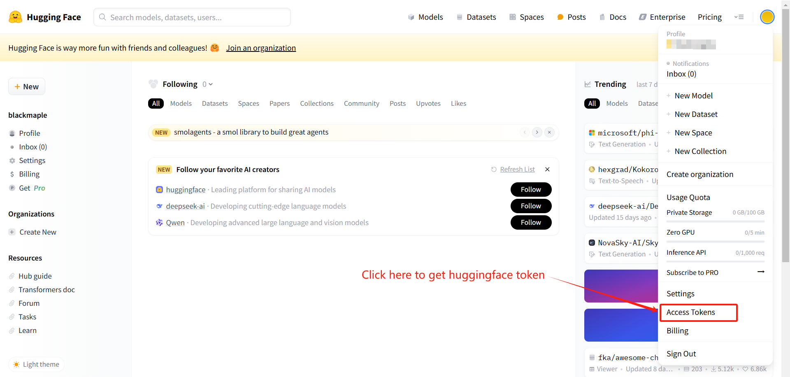

构建一个用来下载huggingface上模型的docker镜像。使用hf mirror镜像源（国内可用）。

# Quick Start

## 1. 构建镜像

```bash
docker build -t hf_download:latest .
```

## 2. 启动容器

启动容器的指令如下

```bash
docker run --rm -it \
  -v <你的下载目录>:/opt/saved_model_parameters \
  -e repo_id=<仓库名称> \
  -e repo_type=<仓库类型> \
  -e branch=<仓库分支> \
  -e token=<你的huggingface账号token> \
  hf_download:latest
```

参数说明：

| 参数名称  | 参数描述                                                     | 是否必传                               | 示例值                  |
| --------- | ------------------------------------------------------------ | -------------------------------------- | ----------------------- |
| repo_id   | 仓库名称（仓库ID）                                           | 是                                     | Qwen/Qwen3-Embedding-8B |
| repo_type | 仓库类型，可选值有：<br />model：模型仓库<br />dataset：数据集仓库<br />space：空间仓库 | 否<br />默认值为model                  | model                   |
| branch    | 仓库的分支                                                   | 否<br />默认值为None，表示选择main分支 |                         |
| token     | huggingface的账户token，仅在下载需要权限的仓库时需要传入<br />比如meta-llama/Llama-3.1-8B-Instruct需要在huggingface上登录并申请权限通过后才有权下载，下载时需要传账户token | 否<br />默认值为None                   | hf_xxxxxxxxx            |

示例指令：

```bash
docker run --rm -it -v /data/my_models:/opt/saved_model_parameters -e repo_id=Qwen/Qwen2.5-14B-Instruct hf_download:latest
```

启动容器即可进行下载，下载完成后会自动删除容器

### 补充说明

#### 1 仓库名称（repo_id） 获取方式

  进入huggingface官网，找到你需要下载的模型，点击模型名称右侧的复制按钮（如下图）


#### 2 仓库分支(branch) 获取方式

进入huggingface官网，找到你需要下载的模型，点击 "Files and versions" 查看仓库文件，文件列表的左上方标明了分支名称。此参数预留给特殊情况使用，因为大部分仓库都只有main分支


#### 3 huggingface账号token 获取方式

  进入huggingface官网，右上角登录你的账号（没有账号可以注册一个），登录后点击头像，选择Access Token
  
  在如下页面创建你的huggingface token并记得复制保存到合适的地方，你的token在创建完成后仅显示一次，如需反复使用请记得保存
  
